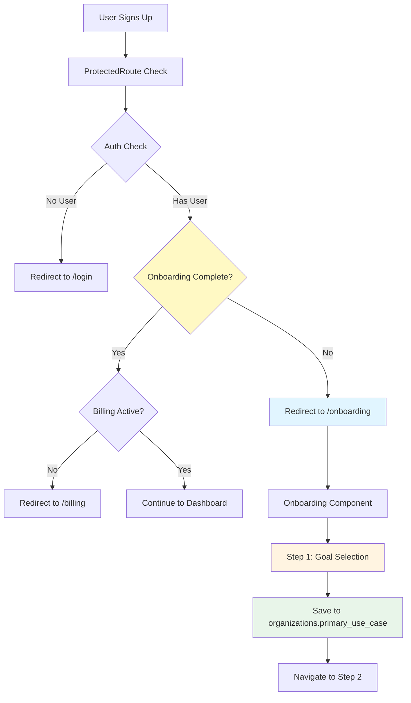

# Phase 1: Foundation + Step 1 Implementation Plan

## Overview

Set up the foundation for the onboarding flow: database schema, routing infrastructure, service layer, and implement Step 1 (Goal Selection) with full Turkish and English i18n support.

## Architecture Flow




## Implementation Tasks

### 1. Database Migration

**File:** `supabase/migrations/20250104000001_add_onboarding_tracking.sql`Add onboarding tracking columns to `organizations` table and create `onboarding_events` table for analytics:

- `onboarding_completed` (BOOLEAN, default FALSE)
- `onboarding_completed_at` (TIMESTAMPTZ)
- `primary_use_case` (TEXT) - stores Step 1 selection
- `team_size_range` (TEXT) - for Step 2
- `onboarding_skipped` (BOOLEAN)
- `onboarding_skipped_at` (TIMESTAMPTZ)
- Create `onboarding_events` table for analytics tracking
- Add indexes for performance

### 2. Onboarding Service

**File:** `src/features/onboarding/services/onboarding.service.ts`Create service class following existing pattern (like `organization.service.ts`):

- `savePrimaryUseCase(orgId, useCase)` - Save Step 1 selection
- `getOnboardingStatus(orgId)` - Check if onboarding is complete
- `trackEvent(orgId, userId, stepNumber, stepName, action, data)` - Analytics tracking
- Use Supabase client, error handling, and logger pattern

### 3. Onboarding Hook

**File:** `src/features/onboarding/hooks/useOnboarding.ts`State management hook:

- Manage current step (1, 2, or 3)
- Store Step 1 selection (`primaryUseCase`)
- Navigation methods (`nextStep`, `previousStep`, `goToStep`)
- Save methods (`saveStep1`)
- Loading and error states
- Use `useOrg` hook to get current organization

### 4. Routing Setup

**Files to modify:**

- `src/config/constants.ts` - Add `ONBOARDING: '/onboarding'` to ROUTES
- `src/App.tsx` - Add onboarding route with ProtectedRoute wrapper
- `src/components/common/ProtectedRoute.tsx` - Add onboarding check logic

**ProtectedRoute logic (CRITICAL ORDER):**

- Step 1: Check auth (existing - no user → redirect to login)
- Step 2: Check onboarding FIRST (NEW - before billing)
- If `currentOrg && !currentOrg.onboarding_completed`
- And not already on `/onboarding` route
- Redirect to `/onboarding` (skip billing check)
- Skip check if already on onboarding page
- Step 3: Check billing (existing - after onboarding)
- Only check billing if onboarding is complete
- Redirect to billing if needed
- Step 4: Render children (if all checks pass)

**Implementation code example:**

```typescript
// In ProtectedRoute.tsx, after auth check:

// Step 2: Check onboarding FIRST (before billing)
const { currentOrg } = useOrg();

if (currentOrg && !currentOrg.onboarding_completed) {
  // Skip check if already on onboarding page (prevent redirect loop)
  if (location.pathname !== ROUTES.ONBOARDING) {
    return <Navigate to={ROUTES.ONBOARDING} replace />;
  }
  // If already on onboarding, allow it (don't check billing yet)
  return <>{children}</>;
}

// Step 3: Check billing (only if onboarding complete)
// ... existing billing check logic ...
```

**Why this order:**

- New users complete onboarding first (better UX)
- Then handle billing/subscription
- Prevents confusing redirects (billing → onboarding → billing)
- Onboarding page should NOT check billing (allow access to onboarding)

### 5. Translation Files

**Files to create:**

- `public/locales/tr/onboarding.json` - Turkish translations
- `public/locales/en/onboarding.json` - English translations

**Translation structure:**

```json
{
  "step1": {
    "title": "Hoş geldiniz! Emlak CRM'ye ne için geldiniz?",
    "subtitle": "Size en uygun deneyimi sunmak için birkaç soru soruyoruz",
    "question": "Emlak CRM'yi ne için kullanacaksınız?",
    "options": {
      "properties": "Emlak listelerimi organize etmek",
      "clients": "Müşteri ilişkilerimi takip etmek (kiracı/sahip)",
      "contracts": "Sözleşme ve belgeleri yönetmek",
      "team": "Ekip işbirliği ve raporlama",
      "all": "Hepsi"
    },
    "skip": "Atla",
    "continue": "Devam Et"
  },
  "progress": {
    "step": "Adım",
    "of": "/"
  }
}
```

**Update i18n config:**

- `src/i18n.ts` - Add 'onboarding' to namespaces array

### 6. Main Onboarding Component

**File:** `src/features/onboarding/Onboarding.tsx`Main container component:

- Use `useOnboarding` hook for state
- Render current step component (Step 1, 2, or 3)
- Include `OnboardingProgress` component
- Handle step navigation
- Use `MainLayout` or similar layout pattern
- Mobile-responsive design

### 7. Progress Indicator Component

**File:** `src/features/onboarding/components/OnboardingProgress.tsx`Visual progress indicator:

- Shows "Step X of 3"
- Progress bar or step dots
- Uses translations for text
- Accessible (ARIA labels)

### 8. Step 1 Component

**File:** `src/features/onboarding/components/Step1GoalSelection.tsx`Goal selection UI:

- Title and subtitle from translations
- Radio button options with icons (🏠, 👥, 📄, 👨‍👩‍👧‍👦, ✨)
- Large touch targets for mobile
- Skip button (defaults to "all")
- Continue button (disabled until selection made)
- Save selection on continue
- Loading state during save
- Error handling with toast notifications
- Use existing UI components (Button, Card, etc.)

## File Changes Summary

### New Files (8)

1. `supabase/migrations/20250104000001_add_onboarding_tracking.sql`
2. `src/features/onboarding/Onboarding.tsx`
3. `src/features/onboarding/components/OnboardingProgress.tsx`
4. `src/features/onboarding/components/Step1GoalSelection.tsx`
5. `src/features/onboarding/hooks/useOnboarding.ts`
6. `src/features/onboarding/services/onboarding.service.ts`
7. `public/locales/tr/onboarding.json`
8. `public/locales/en/onboarding.json`

### Modified Files (4)

1. `src/config/constants.ts` - Add ONBOARDING route
2. `src/App.tsx` - Add onboarding route
3. `src/components/common/ProtectedRoute.tsx` - Add onboarding check
4. `src/i18n.ts` - Add 'onboarding' namespace

## Success Criteria

- [ ] Database migration runs without errors
- [ ] New user signup redirects to `/onboarding` (if incomplete)
- [ ] Step 1 UI renders correctly in Turkish (default)
- [ ] Step 1 UI renders correctly in English (when language changed)
- [ ] Goal selection saves to `organizations.primary_use_case` table
- [ ] Progress indicator shows "Step 1 of 3" / "Adım 1 / 3"
- [ ] Continue button navigates to Step 2 (placeholder for now)
- [ ] Skip button works (defaults to "all", saves, navigates)
- [ ] Loading states show during save operations
- [ ] Error handling works (toast notifications)
- [ ] Mobile responsive design
- [ ] ProtectedRoute correctly redirects incomplete onboarding

## Testing Checklist

1. **New User Flow:**

- Sign up → Should redirect to `/onboarding`
- Step 1 should be visible

2. **Step 1 Functionality:**

- Select each option → Should save correctly
- Click Continue → Should navigate to Step 2
- Click Skip → Should default to "all" and navigate

3. **i18n Testing:**

- Default language (Turkish) → All text in Turkish
- Change language → Text updates (if language selector exists)

4. **Database Verification:**

- Check `organizations.primary_use_case` column has correct value
- Check `onboarding_events` table has tracking events

5. **Routing:**

- Incomplete onboarding → Redirects to `/onboarding`
- Complete onboarding → Can access dashboard normally

## Dependencies

- `useOrg` hook (from OrgContext) - to get current organization
- `useTranslation` hook (from react-i18next) - for translations
- Existing UI components (Button, Card, etc.)
- Supabase client (already configured)
- Toast notifications (sonner)

## Notes

- Follow existing code patterns (service classes, hooks, component structure)
- Use TypeScript with proper types
- Mobile-first responsive design
- Accessibility (ARIA labels, keyboard navigation)